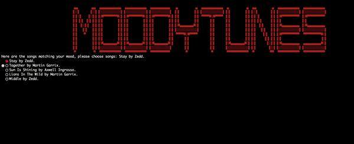

<h1 align="center">MoodyTunes :notes:</h1>
<h3 align="center"> A Ruby CLI Application inspired by Spotify Music App.</h3>
<h4 align="center">
  Built by
  <a href="https://github.com/saimaar">Saima Rahman</a> and
  <a href="https://github.com/rexy91"> Rex Ye</a>
  
</h4>

  

In this project we used knowledge of plain <code>Ruby</code>, <code> Active Record Associations </code>, and database management.

## Features 
- Animated Welcome, with Music Audio in the background
- User can Sign up/Sign.
- Includes prompts for Users to:
  - Add Music to their playlist.
  - Select a Mood and play songs.
  - Remove song from the playlist 
- User can update username.
- User can view their playlist

## Tech Stack
This web app makes use of the following:
- Ruby [2.6.1]
- SQLite3 [~> 1.4] - Database
- Sinatra-activerecord - Gem that extends Sinatra with ActiveRecord helper methods and Rake tasks
- TTY::Prompt - Gem that provides easy option selection
- Colorize - Gem for colorizing text using ANSI escape sequences

## Fun Gems 
- `faker` - randomly generated seed data fun
- `colorize` - colored text output in your terminal
- `lolcat` - enabling rainbow text coloring
- `tty-prompt` - nice interface for prompting for user input
- `figlet` - different positioning properties and color properties with the help of other gems

